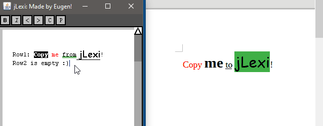
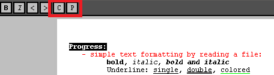
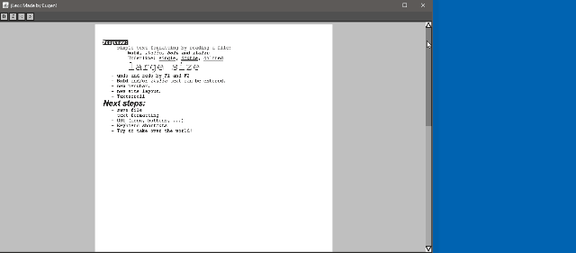
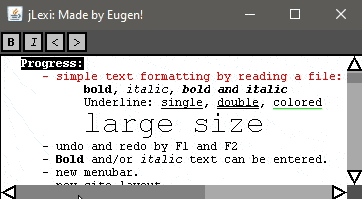
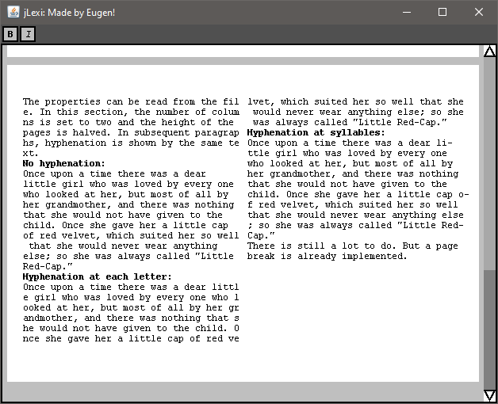
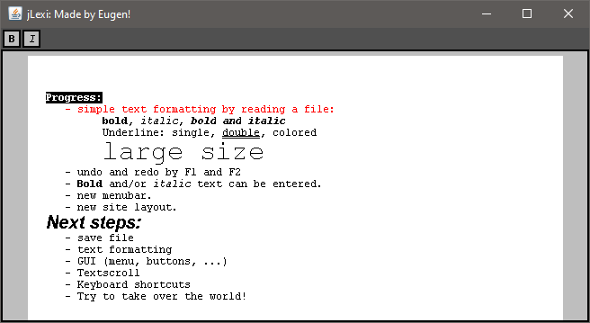
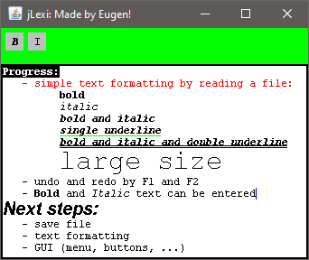
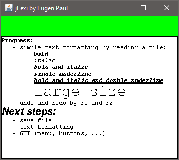
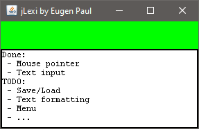
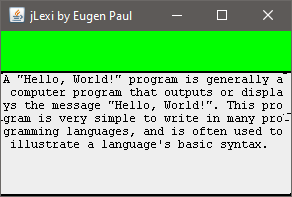

# jLexi
## Intro
My Java implementation of document editor Lexi (jLexi) based on book "Design Patterns: Elements of Reusable Object-Oriented Software". Almost all classes have to be implemented by myself, because only the abstract classes and interfaces that should be used are described in the book. The book describes the parretn to use. The implementation of the classes remains open. 

I want to try to implement it.

In the implementation I only use two Java Swing classes: JFrame and JPanel to create a window. All other Elements (menu, text pane, ...) will be implemented by myself.

## Progress

### Step 9
Copy and paste formatted text from and to jLexi.

.

### Step 8
Selected text can be copied to the system clipboard using F3 or the C button.

Selected text can be copied from the system clipboard using F4 or the P button.

.

### Step 7
The structure of the page display has been partially redesigned. Almost all components are combined into the lines and/or column. The approach allows to display several pages of a document side by side without any effort, if the window is large enough.

.

### Step 6
Undo (**<**) and Redo (**>**) buttons.

Simple text selection was implemented.

By pressing **B** and **I** buttons, the format of the selected text will be changed.

.

### Step 5
More properties (page size, number of columns, page breaks/sections, hyphenation, ...) can be read from the file.

Single scrollbar component is implemented. The scrollbar can be displayed always or on need. By clicking on the scrollbar or using the mouse wheel, text can be scrolled.

The first hyphenation algorithms are implemented and can also be loaded when loading the file (see example below).

.

### Step 4
A few classes for better representation of the objects.

.

### Step 3
Colored text can be read from file.

Bold and italic text can be entered.

.

### Step 2
Formatted text can be read from file.

Undo/Redo by F1/F2.

.

### Step 1
Mouse pointer is displayed and blinking.

Mouse pointer can be moved with left and right arrows or placed with the mouse. 

Text can be entered and deleted. 

.

### Step 0
The first text can be displayed in the editor. I'm so happy :).

.