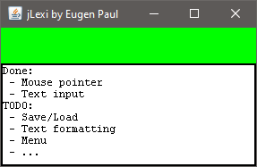

# Intro
My Java implementation of document editor based on book "Design Patterns: Elements of Reusable Object-Oriented Software". Almost all classes have to be implemented by myself, because only the abstract classes and interfaces that should be used are described in the book. The book describes the parretn to use. The implementation of the classes remains open. 

I want to try to implement it.

In the implementation I only use two Java Swing classes: JFrame and JPanel to create a window. All other Elements (menu, text pane, ...) will be implemented by myself.

# Progress
## Step 1
The first text can be displayed in the editor. I'm so happy :).

.

## Step 2
Mouse pointer is displayed and blinking.
Mouse pointer can be moved with left and right arrows or placed with the mouse. 
Text can be entered and deleted. 

.
